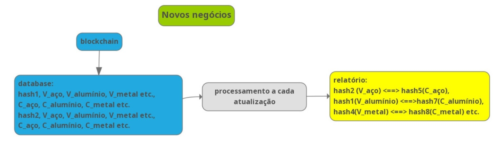
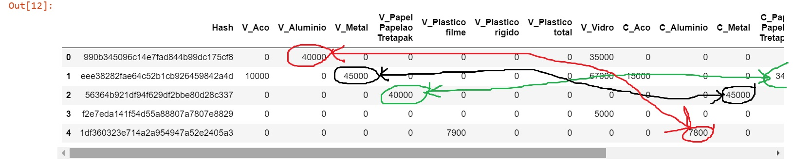

# Alysida - Novos Mercados

O site de **Alysida** está em http://alysida.com.br/?p=6

Ao se registrar sua mercadoria na Blockchain, o usuário poderá registrar também quais resíduos e a quantidade, que deseja comprar ou vender. Esses dados, depois de registrados na Blockchain, formarão um database.

Esse database será processado a cada novo registro e irá estabelecer as ligações de compra e venda dos usuários. 

Em desenvolvimento 

https://share.streamlit.io/luiscarloseiras/gpt-2pt/main/gpt-2.py
